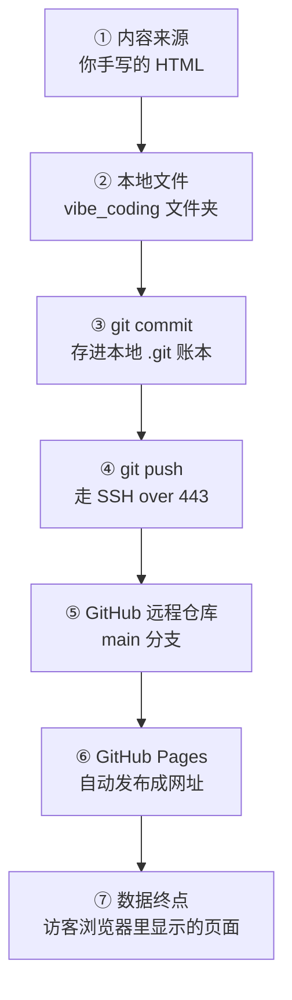

# 技术设计（TECH_DESIGN.md）

> Day 5 产出 · 2026-09-21 · 项目：**个人主页**
> 上游：`research.md`（Day 3）、`PRD.md`（Day 4）。本文档回答"用什么做、数据怎么流动"。

## 一、技术路线（一行结论）

> **纯静态网站：手写 HTML + 手写 CSS + 约 5 行原生 JavaScript，用 Git 管版本、经 SSH 推送到 GitHub，最终由 GitHub Pages 发布。不用框架、不用构建工具、不用数据库、不用服务器。**

### 每条选择的理由

| # | 决策 | 选择 | 为什么选它 | 代价 / 风险 | 什么时候该重议 |
|---|---|---|---|---|---|
| 1 | 页面结构 | 纯静态 HTML，2 个页面 | 内容固定，没有"用户提交内容"的需求；零服务器成本 | 改内容要改文件并重新推送 | 想让访客自己发文 / 留言时 |
| 2 | 样式 | 手写 CSS，放在同目录 `style.css` | 页面简单（约 60–80 行够用）；每一行可读可改；不引任何第三方资源，满足 PRD F1-7 | 比套框架慢；没有现成组件 | 页面涨到 5 个以上，或需要复杂组件时 |
| 3 | 交互 | 原生 JavaScript，**约 5 行**，内联在 `work.html` 里 | 只为实现 PRD F1-5 / F2-2「从网址读出作品名」；不额外建 js 文件，最少文件数 | 需要看懂一点点 JS 语法 | 要做筛选、搜索、表单提交时 |
| 4 | 版本管理 | Git + **SSH over 443** | 已在用且稳定；当前网络环境下 HTTPS 通道被拦截，SSH:443 是实测唯一走通的通道 | 无 | 基本不用改 |
| 5 | 部署 | **GitHub Pages** | 仓库本来就在 GitHub；开启后自动从 `main` 分支发布；免费；与已学的 Git 流程无缝 | 国内访问速度一般（首屏可能 2–5 秒） | 访客主要在国内且在意速度时 → 换 EdgeOne Pages / 腾讯云静态托管 |

### 明确不用的技术

| 不用的东西 | 为什么不用 |
|---|---|
| CSS 框架（Tailwind / Bootstrap） | 需要引入外部文件，违反 PRD F1-7；且出错时你不好排查 |
| 构建工具（Vite / Webpack） | 两个静态页没有"打包编译"这个需求 |
| 数据库 / 服务器 / 云主机 | 本版没有要存的数据、没有要算的逻辑 |
| npm 依赖包 | 零依赖 = 零维护、零漏洞、几年不坏 |

## 二、前后端与数据库分工

用一家餐厅打比方：

| 层 | 餐厅里对应 | 技术上干什么 | 本项目 |
|---|---|---|---|
| 前端 | 菜单、餐桌、服务员 | 用户看得见、点得到的一切 | ✅ 有：`index.html` + `work.html` |
| 后端 | 后厨 | 服务器上跑的逻辑（验证登录、处理请求） | ❌ 没有 |
| 数据库 | 仓库 | 把数据存起来（用户、文章、订单） | ❌ 没有 |

### 为什么这个项目不需要后端和数据库（三条理由）

1. **内容是固定的**：名字、一句话介绍、作品说明都是你亲手写进 HTML 的，没有"用户提交内容"这回事，所以不需要仓库（数据库）。
2. **页面没有"要算的东西"**：登录要验证密码、下单要扣库存——这些才需要后厨（后端）。主页只是把文字和链接展示给访客，浏览器自己就能干完。
3. **少一层，少一堆麻烦**：后端和数据库要租服务器、要维护、要花钱、有漏洞还要担心。纯静态方案可以免费挂在 GitHub 上，几年不管也不会坏——这也正是 research.md 里说的避开"开局贪大"这个死因。

> **注意**：「功能少」不等于「技术弱」。大量官方文档站、公司产品介绍页同样是纯静态的。选择简单，是因为需求简单——这是设计判断，不是能力不足。

## 三、数据流图 ⭐

### 一句话说清

> **数据（内容）来自你手写的 HTML 文件 → 经 Git 存档并推送到 GitHub → 由 GitHub Pages 发布成公网网址 → 访客的浏览器下载后显示在屏幕上。全程没有服务器、没有数据库，数据只出不回。**

### 图



### 关键点：这是一条"单向管道"

| 环节 | 数据形态 | 存在哪 |
|---|---|---|
| ① → ② | 纯文本文件（HTML/CSS） | 你的电脑硬盘 |
| ③ | 版本快照（commit） | 你的电脑硬盘（`.git` 文件夹） |
| ④ → ⑤ | 加密传输中的文件 | 网络 → GitHub 服务器 |
| ⑥ → ⑦ | 网页内容 | GitHub 服务器 → 访客浏览器（临时缓存） |

**没有任何一个环节把访客的信息传回来**——没有表单、没有登录、没有埋点。这也是为什么这个网站不需要考虑"数据安全"和"隐私合规"。

### 文字版（万一图没渲染出来）

```
你手写 HTML  →  本地 vibe_coding 文件夹  →  git commit（本地存档）
    →  git push（SSH 443）  →  GitHub 远程仓库  →  GitHub Pages 发布
    →  公网网址  →  访客浏览器显示
```

## 四、文件清单

| 文件 | 现在的状态 | 职责 | 属于哪天 |
|---|---|---|---|
| `AGENTS.md` | ✅ 已存在 | 项目规则（和 AI 的协作约定） | Day 1 |
| `.gitignore` | ✅ 已存在 | 忽略名单：`.env`、`.workbuddy/`、`desktop.ini` | Day 2 |
| `index.html` | ✅ 已存在（占位版） | 首页——现是占位页，Day 6/7 重写为正式版 | Day 2 建 / Day 7 重写 |
| `research.md` | ✅ 已存在 | 需求研究（痛点、三个同类产品、差异化、本期不做） | Day 3 |
| `PRD.md` | ✅ 已存在 | 产品需求（含 16 条可勾选验收标准） | Day 4 |
| `TECH_DESIGN.md` | ✅ 本文档 | 技术设计（路线、分工、数据流、文件清单） | Day 5 |
| `style.css` | ⏳ 待建 | 全部样式（配色、字体、版式）——两个页面共用一份 | Day 6 |
| `work.html` | ⏳ 待建 | 作品详情页（含内联的约 5 行 JS） | Day 7 |
| `README.md` | ⏳ 可选 | 仓库说明（给访客看这是什么） | 待定 |

> **关于 `style.css` 为什么要单独一个文件**：两个页面共用同一套样式，写一份比在 HTML 里写两份更好改。PRD F1-7 允许"内联或同目录文件"，这属于同目录文件，合规。

## 五、关于技术栈（零基础科普）

**技术栈**（tech stack）= 做这个产品用到的"技术工具清单"。就像开餐厅要列出：炉灶、冰箱、收银机。

### 做网页/App 一般会用到什么

| 技术 | 干什么 | 优点 | 缺点 |
|---|---|---|---|
| **HTML** | 页面的骨架：标题、段落、链接、图片 | 极简单；所有浏览器都懂 | 只管结构，不管好不好看 |
| **CSS** | 页面的长相：颜色、字体、间距、布局 | 与 HTML 分离，改样式不用动结构 | 规则多，写复杂布局要经验 |
| **JavaScript** | 页面的行为：点击响应、读取数据、动画 | 浏览器里就能跑，不用装东西 | 写复杂逻辑容易出 bug 且难调试 |
| **前端框架**（React / Vue） | 用组件方式写复杂页面 | 大项目里好维护 | 小题大做；要学一整套概念和工具链 |
| **后端语言**（Node.js / Python） | 服务器上处理请求、访问数据库 | 能做登录、支付、动态内容 | 要服务器、要运维、要安全防护 |
| **数据库**（MySQL / SQLite） | 结构化的数据存储和查询 | 数据可持久、可检索 | 要设计表结构、要备份、要迁移 |
| **构建工具**（Vite / Webpack） | 把源码打包压缩成浏览器能跑的文件 | 大项目必备；能做代码分割与优化 | 配置复杂；小项目纯属负担 |

### 你的项目用哪些？为什么？

**只用了 HTML + CSS + 一点点 JavaScript**，其余全部不用。理由在第一节的路线表里已经逐条写明——核心逻辑是：**需求有多简单，技术就用多简单。**

### 一个重要观念（记住这个比记命令有用）

> **选技术栈的标准不是"哪个更先进"，而是"哪个最匹配当前需求"。**
> 今天能用 3 个文件搞定的事，用 10 个工具去做，不是进步，是负债。等需求真的长出来了（比如要留言、要登录），再升级不迟——这在第一节的"什么时候该重议"一列已经写好了。

## 附录：方案变化时，哪些文件会受影响

> 用途：以后你想改点什么，先查这张表，就知道要动几个地方。

| 如果变化 | 受影响的文件 | 要做什么 |
|---|---|---|
| 换个配色 / 字体 | `style.css` | 只改 CSS，HTML 一个字不用动 |
| 加一个作品卡片 | `index.html`（加卡片）、`work.html`（加一条作品数据） | 加两处，共几步 |
| 改联系方式 | `index.html` | 改一处 |
| 改成"每个作品一个独立页面" | `index.html`、新增 `work-1.html` / `work-2.html`、`work.html` 可删 | 改动较大；同时要微调 PRD 措辞 |
| 加留言板 | 全部 + 需要引入第三方服务或自建后端 | **超出本期范围**，等于换了一个项目 |
| 换部署平台（如换到腾讯云） | 不涉及任何文件 | 只改平台设置，零代码改动 |
| 改网站名字 | `index.html`（`<title>` 与页面标题） | 改一处 |

---

*本文档与 `PRD.md` 逐条对齐：技术路线的每项选择都主动满足 PRD 的验收标准要求，不引入 PRD 未允许的依赖。*
